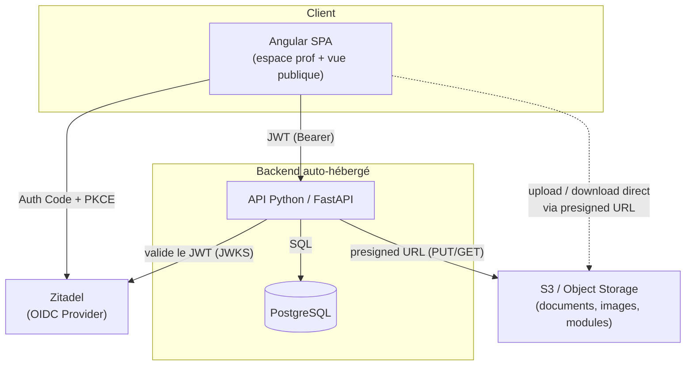
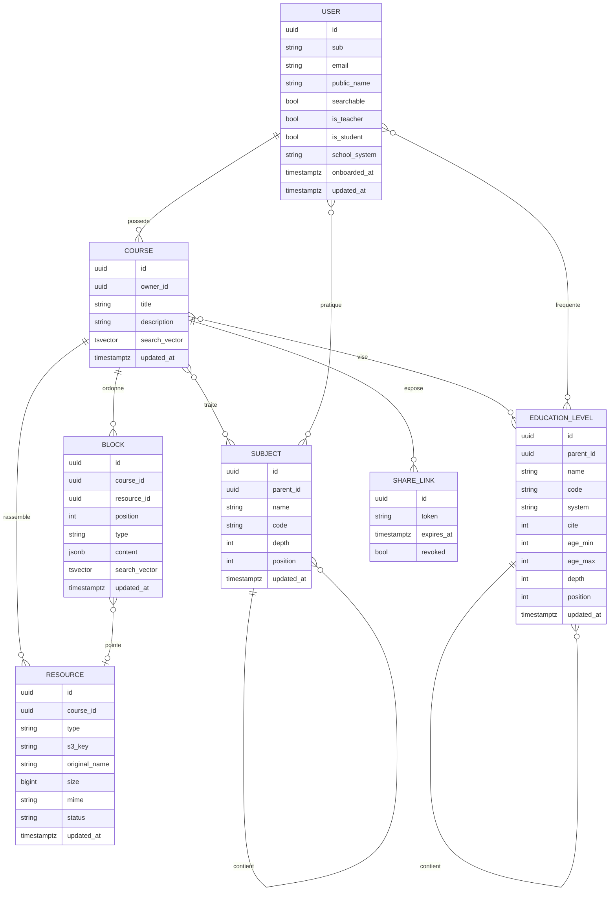

# Cartable — Plateforme pédagogique auto-hébergée

> **Pitch & cadrage technique** — document de cadrage destiné à amorcer le développement (Claude Code).
> *Cartable* est un nom de travail, à remplacer librement.

---

## 1. En une phrase

Une plateforme où un enseignant compose ses cours (texte, documents, images, modules interactifs), les organise par matière, et les partage à ses élèves via de simples liens publics — l'édition étant réservée au prof via authentification.

---

## 2. Le besoin métier

### Contexte
Un enseignant produit beaucoup de supports hétérogènes (PDF, images, schémas, énoncés, et à terme des exercices interactifs en HTML/JS). Aujourd'hui ces ressources sont éparpillées (mail, clé USB, ENT, Drive). Il manque **un point d'entrée unique, organisé et partageable** que les élèves consultent sans friction (pas de compte à créer).

### Utilisateurs & rôles
| Rôle | Authentification | Peut |
|------|------------------|------|
| **Prof** (toi) | OIDC / Zitadel | Créer / organiser / éditer cours, ressources et modules ; gérer les liens de partage |
| **Élève** | Optionnelle : aucune (lien public) ou compte OIDC / Zitadel | Consulter un cours partagé, télécharger les documents, lancer les modules interactifs — sans compte ; un compte (facultatif) porte un profil (système scolaire, niveaux, matières apprises) |

Les rôles applicatifs sont **cumulables** : un même compte peut être prof *et* élève (ex. enseignant en reprise d'études). Tout compte passe par un **onboarding bloquant** à la première connexion (rôles → système scolaire → niveaux → matières, par contexte « enseigne »/« apprend »). L'accès par lien public reste le mode par défaut pour les élèves : le compte élève est une commodité de profil, jamais une condition d'accès aux cours partagés.

### Cas d'usage clés (user stories)
- *En tant que prof*, je crée un cours « Suites numériques » et j'y agence un texte d'introduction, deux PDF, trois images et un quiz interactif, dans l'ordre que je veux.
- *En tant que prof*, je génère un lien public pour ce cours et je le colle dans l'ENT / au tableau.
- *En tant que prof*, je retrouve un ancien support en cherchant « théorème de Pythagore » dans toute ma base.
- *En tant qu'élève*, j'ouvre le lien, je lis le cours, je télécharge le PDF et je fais le quiz — sans créer de compte.

### Hors périmètre (volontairement)
Notes, rendus d'élèves, messagerie, gestion de classe. Ce n'est pas un ENT, c'est un **hub de diffusion de contenu pédagogique**.

---

## 3. Périmètre fonctionnel

### MVP (ce qu'on code en premier)
- Auth prof via Zitadel (OIDC).
- CRUD **Cours** organisés par **Matière**.
- Upload de ressources (PDF, images) vers S3 + métadonnées en base.
- Édition d'un cours sous forme de **blocs ordonnés** (texte riche + ressources intercalées).
- Génération d'un **lien public** par cours ; rendu lecture seule pour les élèves.
- Recherche plein texte sur titres / contenu / tags.

### V1
- **Modules interactifs** HTML/JS (upload, sandbox, intégration dans un cours).
- Facettes de recherche (matière, niveau, type).
- Aperçus / miniatures des documents.
- Liens de partage avec options (expiration, révocation).

### Plus tard — couche IA (terrain déjà préparé)
- Extraction de texte des documents → indexation sémantique (**ChromaDB**, si la vectorisation est actée).
- Recherche sémantique et RAG sur la base de cours.
- Génération assistée : résumés, quiz, fiches de révision à partir d'un cours.

---

## 4. Architecture cible

### Composants & responsabilités
- **Angular SPA** — UI unique servant à la fois l'espace prof (authentifié) et la vue publique des cours partagés. Gère le flow OIDC côté navigateur.
- **API FastAPI** — logique métier, autorisation, modèle de données, signature des URL S3, recherche. Choix de Python pour préparer la couche IA.
- **PostgreSQL** — source de vérité des métadonnées, du contenu éditorial (blocs) et de l'indexation plein texte. Si une indexation sémantique est actée plus tard, elle passera par une base vectorielle dédiée (ChromaDB pressenti), pas par une extension Postgres.
- **S3** — stockage des binaires (fichiers, images, bundles de modules). Bucket **privé** ; tout accès passe par des URL présignées.
- **Zitadel** — fournisseur OIDC, gère uniquement l'identité du/des profs.

### Stack retenue
| Couche | Choix | Notes |
|--------|-------|-------|
| Front | Angular | + `angular-oauth2-oidc` pour le flow OIDC |
| API | Python / **FastAPI** | async, typé (Pydantic), OpenAPI auto |
| ORM / migrations | SQLModel ou SQLAlchemy + **Alembic** | |
| Auth API | validation JWT via **JWKS** Zitadel (`pyjwt`) | le flow OIDC est géré par la SPA |
| Stockage | **boto3** (compatible S3) | presigned URLs |
| Recherche | Postgres **FTS** (`tsvector`/GIN) → puis vectorisation éventuelle via **ChromaDB** (à confirmer) | |
| Déploiement | Docker Compose ; reverse proxy **nginx** fourni et branché par l'infra | sur Raspberry Pi |

---

## 5. Enjeux techniques

C'est le cœur du projet. Chaque point ci-dessous est un vrai arbitrage à trancher tôt.

### 5.1 Authentification & double régime d'accès
Le point structurant : **deux populations, deux modèles d'accès** sur la même API.
- **Prof** : flow OIDC *Authorization Code + PKCE* entièrement géré **côté front** (client public Angular, pas de secret). Le back ne reçoit que le token : il ne fait **pas** de session, il valide le JWT Zitadel à chaque requête (signature via JWKS découvert depuis l'issuer, vérif `issuer` / `audience` / expiration) et lit les rôles dans les claims. Seuls deux réglages côté API : `OIDC_ISSUER` et `OIDC_AUDIENCE`.
- **Élève** : **non authentifié** pour la consultation. L'accès aux cours partagés est porté par un *token de partage* opaque (cf. 5.6), pas par une identité. Un élève *peut* toutefois créer un compte OIDC pour disposer d'un profil — cela ne change rien au régime d'accès aux liens publics.
- Conséquence : des routes « admin » (JWT requis) et des routes « publiques » (token de partage requis) bien séparées, avec deux dépendances d'autorisation distinctes côté FastAPI.
- **Comptes & profil** : l'API ne stocke toujours aucun credential — la table `users` ne porte que le `sub` OIDC (auto-provisioning au premier `GET /api/v1/users/me` d'un JWT valide, `ON CONFLICT DO NOTHING`), l'e-mail en snapshot et le profil d'onboarding (rôles cumulables `is_teacher`/`is_student`, système scolaire, niveaux et matières par contexte). Les rôles applicatifs vivent **en base**, indépendants des rôles Zitadel des claims (`urn:zitadel:iam:...`) : changer d'IdP ne touche ni le modèle ni l'onboarding.

### 5.2 Stockage & gestion des fichiers (S3)
- **Bucket privé**, jamais exposé directement. L'API mint des **URL présignées** : `PUT` pour l'upload, `GET` (TTL court) pour la lecture/téléchargement.
- **Upload direct navigateur → S3** via presigned PUT, pour ne **pas** faire transiter les gros fichiers par le backend (essentiel vu l'hébergement sur Pi : on préserve RAM et bande passante du serveur). **Exception actée** : l'export/import de cours (`app/course_transfer/`) assemble et parse l'archive `.zip` côté API — binaires compris —, volumes bornés (`TRANSFER_MAX_ZIP_BYTES` 500 Mo par archive, `S3_MAX_UPLOAD_BYTES` 100 Mo par fichier) ; le plafond dur du corps HTTP relève du nginx d'infra, hors repo (Starlette spoole le multipart sur disque avant le handler).
- **Organisation** : clé préfixée par cours (`courses/<course_id>/resources/<resource_id>/<nom-sanitizé>`) — purge par préfixe simple à la suppression d'un cours — la hiérarchie logique (matière → cours → ressource) restant portée par la **base**, pas par les préfixes S3.
- **Cohérence DB↔S3** : la ligne `resource` est créée *avant* l'upload avec `status='pending'` ; un endpoint de confirmation vérifie l'objet (HEAD S3) et passe le statut à `'available'`. Seules les ressources disponibles sont servies.
- **Types & previews** : PDF et images au MVP. Génération de miniatures/aperçus à différer (coûteux en CPU sur ARM — à faire en tâche asynchrone, voire à la demande).

### 5.3 Modélisation du contenu : blocs (progression) et ressources (bibliothèque), découplés
Pour « agencer texte de cours + documents + images », le modèle gagnant est un **contenu par blocs ordonnés** (façon éditeur type Notion, en plus simple), avec une séparation stricte : les **blocs** portent la progression pédagogique, les **ressources** (fichiers S3) forment une **bibliothèque par cours**, indépendante des blocs.
- Un cours = une liste ordonnée de blocs de quatre types : `text`, `exercise`, `document`, `module`.
- Le **texte de cours** (bloc `text`) est du **markdown simple stocké dans le JSONB du bloc** (`{"markdown": ...}`) — pas de HTML brut : plus sûr, réindexable, directement exploitable par l'IA. Titres, paragraphes, encadrés **et liens externes** sont couverts par le markdown, sans types de blocs dédiés (l'ancien type `lien` a été supprimé).
- Les **exercices** (bloc `exercise`) portent des questions à champ libre dans le JSONB, chacune avec un **id uuid stable** généré côté service : les soumissions élèves (J2) et la review IA référenceront `(block_id, question_id)`.
- Les blocs `document` sont un **pont nullable** vers une ressource de la bibliothèque du cours : la référence vit en **colonne** `resource_id` (jamais dans le JSONB, qui ne porte que l'éditorial `{"caption", "display"}`). Un bloc document naît vide et se remplit dans l'éditeur ; supprimer la ressource **supprime** les blocs qui la pointent (FK `CASCADE` — un document sans son fichier n'a pas de sens). Une ressource peut exister sans aucun bloc, et être pointée par plusieurs blocs.
- Les blocs `module` (modules interactifs HTML/CSS/JS, cf. §5.5) suivent le même motif que les blocs `document` : un **pont nullable** vers un module de la **bibliothèque de modules du cours** (table `modules`), référencé par la **colonne** `module_id` (jamais dans le JSONB, réservé pour de futurs réglages d'affichage), FK `CASCADE` (supprimer le module supprime ses blocs pointeurs), CHECK de cohérence symétrique à celui des documents.
- Enjeu UX côté Angular : page de cours à onglets (Blocs / Ressources / Modules / Aperçu), éditeur d'ordre des blocs (drag & drop), picker de ressources dans l'éditeur du bloc document, picker de module dans l'éditeur du bloc module.

### 5.4 Recherche (J3 — livré)
- **FTS Postgres** en config **`french_unaccent`** : extension contrib `unaccent` + copie de la config `french` (stemming français ET insensibilité aux accents, à l'indexation comme à la requête — « theoreme » trouve « Théorème »). Exception **actée** à la règle « pas d'extension Postgres » (arbitrage explicite du J3). Requêtes via `websearch_to_tsquery` (syntaxe libre type moteur de recherche, injection-safe par construction).
- **Deux vecteurs stockés, combinés à la requête** (jamais consolidés — consolider imposerait de ré-agréger tout le cours à chaque autosave de bloc) : `courses.search_vector` (titre poids A, description B) et `blocks.search_vector` (titre B ; description, markdown, énoncés d'exercice et légendes C — construit **champ par champ, jamais le `content` entier** : `expected_answer`, le corrigé du prof, ne doit pas devenir cherchable depuis le régime public). Maintenus par **triggers PostgreSQL** `BEFORE INSERT OR UPDATE OF …` (fonctions SQL `courses_tsvector`/`blocks_tsvector` partagées entre triggers et backfill de migration — une seule définition de « quoi indexer »), index **GIN** sur chaque vecteur.
- **Régime public sans JWT** (package `app/search/`, routes `GET /api/v1/public/search/courses` et `/teachers`) — règle d'or : seuls les cours `visibility='public'` remontent ; un prof ne remonte que si `searchable` (**opt-in explicite** du profil, `users.searchable`) AND `public_name` non NULL AND au moins un cours public — son vecteur est calculé **à la volée** (nom public + matières « teaching », table minuscule). Pas d'oracle : une facette inconnue renvoie une page vide, jamais une erreur (une URL partagée avec un id périmé reste servable).
- **Facettes** : matière = sous-arbre entier via le `code` (chemin slug complet unique, préfixe `LIKE` — pas de CTE récursive) ; niveau = nœud + enfants directs (2 profondeurs max). Les arbres de taxonomie sont aussi exposés en **lecture publique** (`GET /api/v1/public/subjects/tree` et `/public/education-levels/tree`, délégation pure) pour alimenter les sélecteurs de la page de recherche anonyme. La recherche **sans texte libre est autorisée** (catalogue public trié `updated_at desc`).
- **Pagination** : première enveloppe paginée de l'API — `{items, total, limit, offset}` (`limit` 1–50, défaut 20 ; `offset` borné) — précédent pour les futures listes.
- Évolution : recherche **sémantique** via ChromaDB si la vectorisation est actée (cf. 5.7), combinable avec la FTS (recherche hybride).

### 5.5 Modules interactifs HTML/CSS/JS (J4 — livré, anticipé)
Le point le plus sensible niveau sécurité : on sert du **code arbitraire** (celui du prof, mais quand même). **Décision actée au J4 (qui a été anticipé avant J2/J3) : le cadrage initial « bundle .zip sur S3, origine de service séparée, versionnage par clé » a été remplacé par un modèle plus simple** — le module est édité dans l'app, pas uploadé :
- Un module = **code HTML + CSS + JS stocké en base** (table `modules` : trois colonnes texte, plafond 200 000 caractères par champ), écrit par le prof dans un **éditeur intégré** (3 Monaco commutés par tabs + preview live). Pas de bundle S3, pas de versionnage par clé — l'historique viendra de la base si besoin.
- Les modules forment une **bibliothèque par cours** (onglet « Modules », motif de la bibliothèque de ressources) : CRUD `/api/v1/courses/{id}/modules` (liste sans le code, détail avec). Un bloc `module` en pointe un via la colonne `blocks.module_id` (cf. §5.3) ; un module peut aussi être **inséré dans le markdown** d'un bloc texte via la référence stable `oc-module:<id>`.
- Rendu **isolé, sans origine de service séparée** : l'isolation vient d'une `<iframe sandbox="allow-scripts allow-forms allow-modals">` **sans `allow-same-origin`**, composée côté front via `srcdoc` → **origine opaque** (`'null'`) : le code du module n'a accès ni aux cookies, ni au localStorage, ni aux tokens, ni au DOM de l'app. Le **réseau sortant est bloqué** par une **CSP embarquée dans le `srcdoc`** côté front (`default-src 'none'` ; autorisés : le code inline du module, **`'unsafe-eval'`** — les modules pédagogiques évaluent des expressions saisies, ex. grapheur de `f(x)` ; sans capacité nouvelle dans une iframe opaque sans réseau, le résidu est un self-XSS élève confiné — et les assets `data:`/`blob:` ; `form-action 'none'`) — décision actée (révise le « CDN autorisés » initial) : un module est **self-contained**, il ne peut ni exfiltrer ce qu'y saisit un élève ni charger du contenu tiers dans son navigateur.
- Communication module ↔ app par **`postMessage` contrôlé** (`oc-module:*`) : auto-resize de l'iframe (ResizeObserver injecté par un bridge avant le code du prof) + événements applicatifs (`ocModule.emit(name, data)`, ex. remonter un score). Côté parent, chaque message est validé par provenance (`event.source` = contentWindow de l'iframe, `event.origin === 'null'`) et par forme ; la hauteur est bornée.

### 5.6 Partage public par lien
- Chaque partage = un **token opaque non devinable** (≥128 bits), lié à un cours.
- Le token donne accès en **lecture seule** au cours et déclenche la génération d'URL présignées pour ses ressources. **Le bucket n'est jamais public.**
- Options à prévoir : révocation, expiration, éventuellement granularité (cours entier vs ressource unique).
- À surveiller : un lien public reste *diffusable* — pas de données sensibles dans les cours partagés (rien de personnel sur des élèves de toute façon, cf. périmètre).

### 5.7 Préparation de la couche IA
- **Brique livrée (hors jalon) : client IA générique multi-provider en « Bring Your Own Token »** (`app/core/ai/`, sur LangChain 1.x). La config (provider, clé API, modèle, base_url) voyage à chaque appel, avec en cascade (décision actée, révise le « l'API ne stocke aucune clé » initial) : config explicite de la requête > **credential utilisateur persistant chiffré** (`app/ai_credentials/` : une config par utilisateur sur la table `users`, clé API chiffrée par `app/core/crypto.py` — AES-256-GCM, dérivation HKDF depuis la clé maître serveur `AI_CREDENTIALS_MASTER_KEY` du `.env` + un sel par utilisateur en colonne ; la clé n'est jamais ré-émise par l'API. Portée : un dump DB seul ou le seul `.env` sont inexploitables, mais un serveur compromis peut déchiffrer — inhérent, l'API doit lire la clé pour appeler le provider) > fallback serveur optionnel (`AI_*`). Providers : Anthropic, OpenAI, Google Gemini, Mistral, Ollama (local ou distant), HuggingFace (endpoints distants uniquement — jamais de modèle chargé en local sur le Pi) et tout endpoint `openai_compatible` (Groq, vLLM, LM Studio…). Deux modes : appel classique et streaming (contrat SSE de référence, route de smoke-test `/api/v1/ai/chat[.../stream]`). Observabilité **Langfuse opt-in** (settings `LANGFUSE_*`, no-op sinon). Le **multi-provider concrétise la contrainte RGPD** ci-dessous : Mistral (hébergé UE) et Ollama (local) sont des providers de première classe.
- La **vectorisation des cours n'est pas actée**. Si elle se fait, elle passera probablement par **ChromaDB** (dépendances déjà présentes dans le backend) — aucune préparation en base Postgres n'est requise d'ici là.
- Prévoir, sans l'implémenter au MVP : un pipeline *extraction de texte (PDF/images) → découpage → embeddings → stockage vectoriel*, déclenché en tâche de fond à l'upload.
- Le choix Python/FastAPI rend naturelle l'intégration ultérieure (RAG, génération de quiz/résumés) : elle consommera le client `app/core/ai/`. Pour le fournisseur de modèle, garder en tête la contrainte RGPD (option hébergée UE type Mistral, ou modèle local selon ressources).

### 5.8 Déploiement & contraintes Raspberry Pi
- **ARM64 + RAM limitée** : tout ce qui est lourd (transfert de fichiers, génération de miniatures, embeddings) doit être **déporté** (presigned URLs) ou **asynchrone**.
- **Zitadel et S3 sont supposés fournis** (externes ou sur une autre machine). Co-héberger Zitadel *et* l'app *et* Postgres *et* du vectoriel sur un seul Pi serait tendu : à arbitrer (Zitadel est gourmand).
- **Conteneurisation** Docker Compose ; le **reverse proxy nginx** devant l'API et le SPA est fourni et branché par l'infra (hors périmètre de ce repo).
- Build Angular en amont (image statique servie par le proxy), pas de build sur le Pi en prod.

---

## 6. Modèle de données (esquisse)

`SUBJECT` est auto-référencée : discipline (profondeur 0) → domaine (1) → sous-domaine (2) → sujet (3), profondeur flexible (une branche peut s'arrêter avant le niveau 3). La taxonomie est pré-remplie par une migration de seed (IDs uuid5 déterministes dérivés du `code`, chemin slug complet — source de vérité : `app/subjects/seed_data.py`, contrat append-only).

`EDUCATION_LEVEL` est auto-référencée : cycle (profondeur 0, ex. « Collège ») → classe (1, ex. « 6e »), un arbre par système scolaire (`system`, « fr » seul pour l'instant). Les noms sont des noms propres nationaux, jamais traduits ; le rapprochement entre pays passe par les pivots internationaux `cite` (CITE/ISCED 2011, NULL quand le nœud couvre plusieurs niveaux, ex. « Supérieur ») et `age_min`/`age_max`. Pré-remplie par migration de seed (IDs uuid5 déterministes, codes manuscrits préfixés système ex. `fr.college.6e` — source de vérité : `app/education_levels/seed_data.py`, contrat append-only ; lecture `GET /api/v1/education-levels/tree`). Le lien `COURSE }o--o{ EDUCATION_LEVEL` (table d'association `course_education_levels`, remplace l'ancien champ texte `niveau`) est implémenté.

`USER` est le compte applicatif (prof et/ou élève, rôles cumulables) : `sub` = identifiant OIDC opaque (seule donnée IdP persistée, ligne créée par auto-provisioning au premier `GET /api/v1/users/me`), `id` = identifiant interne, seul référencé par les autres tables. Le profil d'onboarding (complet quand `onboarded_at` est posé) relie l'utilisateur aux matières (`user_subjects`) et aux niveaux (`user_education_levels`) via des tables d'association qualifiées par `context` (« teaching » / « learning ») — c'est le contexte, pas le rôle, qui porte la sémantique d'une ligne ; les niveaux choisis doivent appartenir au `school_system` du profil (validation en service ; soumission `PUT /api/v1/users/me/onboarding`, sémantique remplacement → sert aussi d'édition de profil).

`COURSE` appartient à un utilisateur (`owner_id`, CASCADE) et est classé par matières (`course_subjects`, M2M : un cours peut relever de plusieurs matières) et par niveaux (`course_education_levels`, M2M). Son contenu est une liste de `BLOCK` triés par `position` (pas d'unicité `(course_id, position)` en base — le réordonnancement réécrit les positions côté service, tri stable `position, id`) ; le `type` (`text`/`exercise`/`document`/`module`) détermine le schéma du `content` JSONB (cf. §5.3) et seuls les blocs `document` peuvent porter une FK `resource_id` — **nullable** (bloc créé vide) et `ON DELETE CASCADE` (supprimer la ressource supprime les blocs qui la pointent) — CHECK de cohérence en base. `RESOURCE` est la **bibliothèque du cours**, indépendante des blocs : `s3_key` plate unique, ligne créée en `status='pending'` avant l'upload presigned puis confirmée `'available'` (cf. §5.2), CRUD complet (liste, renommage, suppression avec purge S3). `MODULE` est la **bibliothèque de modules interactifs du cours** (J4, livré) : `title` + code `html`/`css`/`js` en colonnes texte (pas de S3, cf. §5.5), CRUD complet ; seuls les blocs `module` peuvent porter une FK `module_id` — **nullable** et `ON DELETE CASCADE`, CHECK de cohérence symétrique à celui des documents. `SHARE_LINK` (J2) est en place (token opaque, expiration obligatoire, révocation soft — cf. §5.6), tout comme les **`search_vector` FTS** de `COURSE` et `BLOCK` (J3) — maintenus par triggers, jamais écrits par l'ORM (cf. §5.4) — et l'opt-in `USER.searchable` de la recherche publique de professeurs.

---

## 7. Roadmap par jalons

| Jalon | Contenu | Objectif |
|-------|---------|----------|
| **J0 — Socle** | Repo, Docker Compose, FastAPI + Postgres + Alembic, validation JWT Zitadel, squelette Angular + login OIDC | Une route protégée qui répond, un login prof qui marche |
| **J1 — Contenu** | Matières, cours, upload S3 (presigned), éditeur de blocs basique | Le prof crée et remplit un cours |
| **J2 — Partage** | Liens publics, vue lecture seule élève, présignature des ressources | Un cours consultable par lien |
| **J3 — Recherche** *(livré)* | FTS Postgres `french_unaccent` (cours publics + profs opt-in, triggers + GIN), facettes matière/niveau, arbres publics, pagination | Retrouver n'importe quel support |
| **J4 — Interactif** *(livré, anticipé avant J2/J3)* | Bibliothèque de modules HTML/CSS/JS par cours (code en base, éditeur intégré) + sandbox iframe origine opaque | Intégrer un quiz dans un cours |
| **J5 — IA** | extraction texte, vectorisation (ChromaDB, si actée), recherche sémantique / RAG | Première brique IA |

Livré hors jalon, en extension du socle J0 : comptes applicatifs (`users`, auto-provisioning par `sub`) et onboarding bloquant (rôles cumulables prof/élève, système scolaire, niveaux, matières) — cf. §2, §5.1 et §6. Également livré hors jalon : l'**export/import de cours** (`app/course_transfer/`) — archive `.zip` (manifest versionné + binaires des ressources) dont le réimport recrée un cours au contenu identique (nouveaux identifiants, références remappées, classement porté par les `code` de taxonomie donc portable entre instances) — cf. §5.2 pour l'exception actée au transit des binaires.

---

## 8. Risques & points d'attention
- **Sécurité des modules JS** : l'isolation vient du **sandbox à origine opaque** (`<iframe sandbox>` sans `allow-same-origin`, composée en `srcdoc`) — jamais d'`allow-same-origin`, jamais de code de module injecté dans le DOM de l'app (cf. §5.5).
- **Fuite via presigned URL** : TTL courts, et ne jamais rendre le bucket public « pour aller plus vite ».
- **Charge sur le Pi** : déporter systématiquement les transferts vers S3 ; jobs lourds en asynchrone.
- **Cohérence DB ↔ S3** : un fichier orphelin sur S3 (upload abandonné) ou une ligne sans objet → prévoir nettoyage / confirmation d'upload (l'API valide que l'objet existe avant de créer la `resource`).
- **Verrouillage Zitadel** : isoler la logique OIDC derrière une petite couche d'abstraction si tu veux pouvoir changer d'IdP un jour.

---

## 9. Brief condensé pour Claude Code

> Construire une plateforme pédagogique : **API FastAPI (Python)** + **Angular** SPA + **PostgreSQL** + **stockage S3** + **auth OIDC Zitadel**.
> Édition réservée au prof (flow OIDC géré par la SPA ; l'API valide le JWT Zitadel via JWKS — config : issuer + audience) ; consultation élève via **liens publics à token opaque**, sans compte.
> Fichiers stockés sur S3 **privé**, accès par **URL présignées** (upload direct navigateur→S3). Cours modélisés en **blocs ordonnés (JSONB)** référençant des ressources. Recherche **FTS Postgres** puis sémantique.
> Modules interactifs HTML/JS servis en **iframe sandbox + CSP** depuis une origine séparée.
> Déploiement **Docker Compose** sur Raspberry Pi, derrière un **nginx géré par l'infra** (déporter le lourd vers S3 / l'asynchrone).
> Commencer par le jalon **J0** (socle auth + une route protégée).
